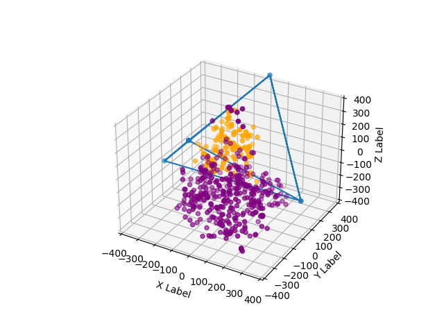

# Tree-Lights

Tree-Lights is my attempt at programming the lights on [Matt Parker's](https://www.youtube.com/user/standupmaths) Christmas Tree.

Watch Matt's video about the tree here: https://www.youtube.com/watch?v=TvlpIojusBE

# Output

This program spins and moves a tetrahedron in 3D space. Lights that are inside the tetrahedron are colored orange, and ones outside are colored purple.

